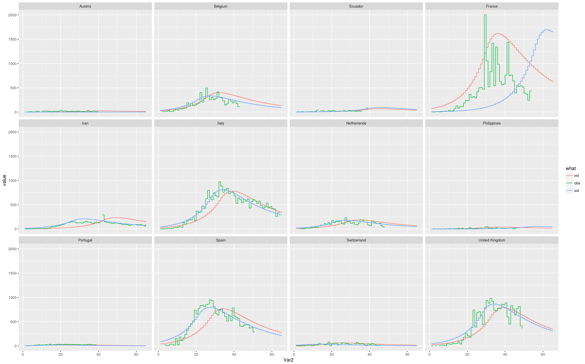

# data

## ourworldindata.org

downloaded from:
https://ourworldindata.org/coronavirus

deaths since 5th confirmed death

## point1acres

Leigh's data:
https://instant.1point3acres.com/v1/api/coronavirus/us/cases?token=XXX

file cases.csv

This data only has US states

# eda

We look at the data from ourworldindata.org

[ourworldindata_all.pdf](ourworldindata_all.pdf)

That's a lot of countries with little deaths.
In our eventual fit, we will weigh by death numbers,
so we might as well throw out countries with few deaths at little cost.


```
> summary(max.deaths.dt$max.deaths)
    Min.  1st Qu.   Median     Mean  3rd Qu.     Max.     NA's
     1.0      7.0     30.0   8637.0    293.5 210200.0        2
```

all entities: 186
entities, >100 deaths: 66
entities >500 deaths: 41

The plot again, just with >500 deaths:
[ourworldindata_500.pdf](ourworldindata_500.pdf)

non-countries amongst the 41:

```
Africa
Asia
Asia excl. China
Europe
European Union
High income
Lower middle income
North America
South America
Upper middle income
World
World excl. China
World excl. China and South Korea
World excl. China, South Korea, Japan and Singapore
```

left over: 27

[ourworldindata_500_countries.pdf](ourworldindata_500_countries.pdf)

We want to choose countries that already peaked.
We plot weekly deaths, counting weeks from the end,
and pick countries in which the peak occurs on week index 2 or more (ie chronologically earlier).

"old peak" Countries:
```
Austria
Belgium
Ecuador
France
Iran
Italy
Netherlands
Philippines
Portugal
Spain
Switzerland
United Kingdom
```

[ourworldindata_500_countries.pdf](ourworldindata_500_countries_oldpeak.pdf)


We clean out outliers:

* zero observations
* more than twice the mean of past three days


# curve model

This paper:
https://www.nature.com/articles/srep35839

fits various distributions to model the incubation period of MERS-CoV in south korea.
Apparently Weibull and Gamma work best and are hardly distinguishable.
Weibull is hard to integrate against, so we use gamma.


This is now implemented in R and vectorized for evaluation during solving.

# optimization

We optimize mean squared distance between observed daily deaths and the curve model.

For starters, we fix the incubation gamma distribution parameters to alpha=3/2, beta=4,
and fix the before-lockdown growth rate to 0.1 and after-lockdown decay rate to 0.04.
These were eye-balled from the data.
These are not subject to optimization yet.

We optimize over remaining country-specific parameters: peak number of deaths and time of lockdown.
These are initialized to the maximum daily death rate, and the day it occurred.

It sort of works.
For most countries, the fit improves.
France goes crazy.




